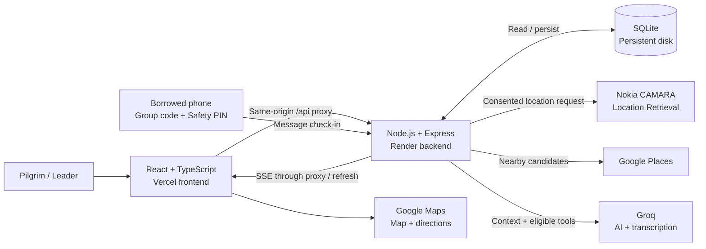

<div align="center">

# SafarAI

### A shared direction. For every pilgrim.

Pilgrimage group coordination with network location, multilingual AI and borrowed-phone check-in.

[](https://safar-ai-beta.vercel.app/)


**MENA Open Gateway Hackathon · Pilgrimage theme**

[Live application](https://safar-ai-beta.vercel.app/) · [Architecture](docs/ARCHITECTURE.md) · [API reference](docs/API.md) · [Configuration](docs/CONFIGURATION.md)

</div>

## Why SafarAI?

Group separation becomes harder in an unfamiliar place, across languages, or when a phone runs out of battery. SafarAI connects group visibility, a shared meeting plan and a way to reach the leader from a borrowed phone.

| Pilgrim challenge                            | SafarAI response                                                                                            |
| -------------------------------------------- | ----------------------------------------------------------------------------------------------------------- |
| Where is my group?                           | Member map, leader reference and a fixed **150 m boundary**.                                                |
| Where should we meet?                        | AI-selected, named meeting places **within 600 m of the leader**, with directions.                          |
| I don't understand the language.             | **30-language selection**, including Arabic, English, Urdu, Hindi, Persian and Deutsch; RTL support.        |
| My question needs an action.                 | Group-aware Copilot can open directions, member details and the device dialer.                              |
| My battery died. I don't know their numbers. | **Group code + five-digit Safety PIN** enables a message check-in from a borrowed phone without signing in. |
| We need help.                                | Group SOS, member contact options and a configurable leader helpdesk number.                                |

## One journey, end to end

> **Omar and Aisha — a hypothetical example**

1. **Choose a language.** Omar speaks German, not Arabic. He selects **Deutsch**; Aisha joins his group.
2. **Notice separation.** A fresh position puts Aisha beyond **150 m**. Her map pin turns red.
3. **Share a destination.** The AI selects an eligible Google Places result within **600 m** of Omar.
4. **Lose battery.** Aisha's phone dies. She cannot recall another member's number.
5. **Borrow and check in.** On a borrowed phone, she enters her **group code + five-digit Safety PIN** and messages where she is.
6. **Reconnect.** Omar receives the group update, confirms and coordinates reunion.

The borrowed-phone flow sends a self-reported message; it does not automatically retrieve that phone's GPS or track a powered-off phone.

## Explore the app

- **Home:** personal boundary status, group counts and role-specific contact actions.
- **Group:** members, available battery readings, status, map links, invitations and updates.
- **Journey:** member pins, the 150 m circle, shared meeting point and directions.
- **Copilot:** multilingual questions, voice transcription and validated group actions.
- **More:** profile, language, Safety PIN and leader helpdesk configuration.

## APIs and technology

| Layer / service                                            | Role in SafarAI                                                                          |
| ---------------------------------------------------------- | ---------------------------------------------------------------------------------------- |
| **Nokia Network as Code / CAMARA Location Retrieval**      | Retrieves consented location evidence for registered Nokia simulator numbers.            |
| **Google Places API (New)**                                | Supplies real nearby candidates for meeting-point selection.                             |
| **Google Maps JavaScript API + Maps URLs**                 | Displays group overlays and opens external directions.                                   |
| **Groq**                                                   | Powers Copilot responses, constrained meeting selection and translation when configured. |
| **Whisper through Groq**                                   | Transcribes recorded voice prompts.                                                      |
| **React 19 + TypeScript + Vite**                           | Frontend components, typed code and builds.                                              |
| **Node.js 24 + Express**                                   | HTTP APIs, authentication, provider calls and orchestration.                             |
| **SQLite**                                                 | Persists members, sessions, locations, messages and group records.                       |
| **Server-Sent Events + refresh fallback**                  | Delivers group updates to connected clients.                                             |
| **Zod, Helmet, express-rate-limit**                        | Input/action validation, HTTP protections and request limits.                            |
| **Lucide, QRCode, Leaflet**                                | Icons, QR generation and fallback map rendering.                                         |
| **Node test runner, TypeScript, Prettier, GitHub Actions** | Tests, type checks, formatting and CI.                                                   |
| **Vercel + Render**                                        | Frontend hosting and Node backend deployment architecture.                               |

**Development tools:** Google AI Studio supported the initial UI design. **Groq is the selected runtime AI provider.** LangChain/LangGraph support an optional advanced guardian module; they are not required for the default meeting-point flow. Additional providers and carrier extensions are separate from the demonstrated Location Retrieval integration.

## Technical architecture



### How the agent acts

**Observe → retrieve → select → validate → publish**

1. Gather authorized group context and available location evidence.
2. Retrieve eligible nearby Google Places candidates.
3. Ask Groq to select from those candidates, rather than invent a destination.
4. Validate the response, place eligibility and group scope on the backend.
5. Publish the shared meeting point; Copilot can open its directions.

Calls open the device dialer. External Google Maps directions do not carry SafarAI's custom group overlays.

## Run locally

**Requirements:** Node.js 24 and npm. No separate database server is required.

```bash
npm ci
```

Create `.env` from `.env.example` in the project root **only if you do not already have one**:

```bash
cp .env.example .env
```

Add your Groq, Google Maps/Places and Nokia values using the [configuration guide](docs/CONFIGURATION.md). Keep private keys out of Git and out of `VITE_*` variables.

```bash
npm run build
npm start
```

Open **http://localhost:3000**. One local Node process serves the frontend, APIs and event stream.

```bash
npm run dev     # Development: rebuild frontend changes
npm test        # Automated tests
npm run check   # Formatting, tests and production build
```

## Deployment

**Application:** [safar-ai-beta.vercel.app](https://safar-ai-beta.vercel.app/)

- **Vercel:** build `npm run build`; output `dist/frontend`; forward `/api/*` to Render.
- **Render:** build `npm ci --include=dev && npm run build`; start `npm start`; set `HOST=0.0.0.0`.
- **Configuration:** private provider keys stay on Render. Set `APP_URL` to the Vercel origin; configure allowed origins and Google Maps referrer restrictions.
- **Persistence:** point `DATABASE_PATH` to an attached persistent disk. An ephemeral filesystem can lose accounts and groups on restart or redeploy.
- **Health check:** `/api/health`.

## Repository map

```text
frontend/       React views, maps, localization and styles
backend/        Express APIs, location providers and AI orchestration
shared/         Types, language definitions and location rules
tests/          API, authorization, provider and rendering checks
scripts/        Translation catalog generation
docs/           Architecture, API and configuration guides
.github/        CI workflows
.env.example    Configuration reference without secrets
```

## Scope and reliability

- **Location:** Nokia simulator results demonstrate integration, not live operator coverage. Browser location requires permission and an active device. Saved positions retain original timestamps; `DEMO_MODE` controls their use in boundary display.
- **Safety:** green indicates position within the boundary, not guaranteed personal safety. PIN reports require leader confirmation and do not automatically close SOS cases.
- **Crowds:** Google Places does not supply live pedestrian density. Crowd-aware ranking requires a separately configured, verified observation feed.
- **Scale:** the current backend is single-instance. Multiple instances need shared persistence and event delivery.

## Adoption and next steps

**Users:** Hajj/Umrah group organizers and the pilgrims they support.

**Proposed model:** operator subscriptions, per-trip group packages and onboarding support. Supervised pilots should measure regrouping time, task completion across languages and willingness to pay.

**Roadmap:** operator-backed field trials, shared database/event infrastructure, authorized carrier reachability/geofencing and verified crowd feeds. These are future work, not claimed deployments.


